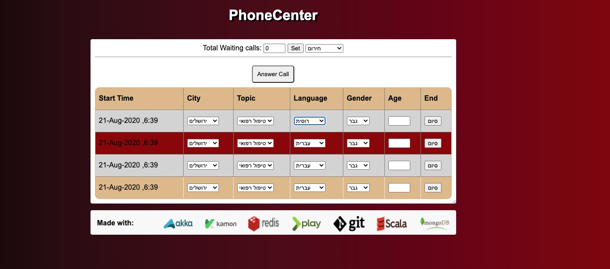
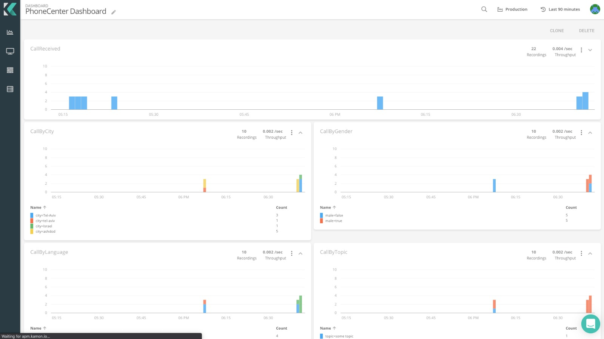
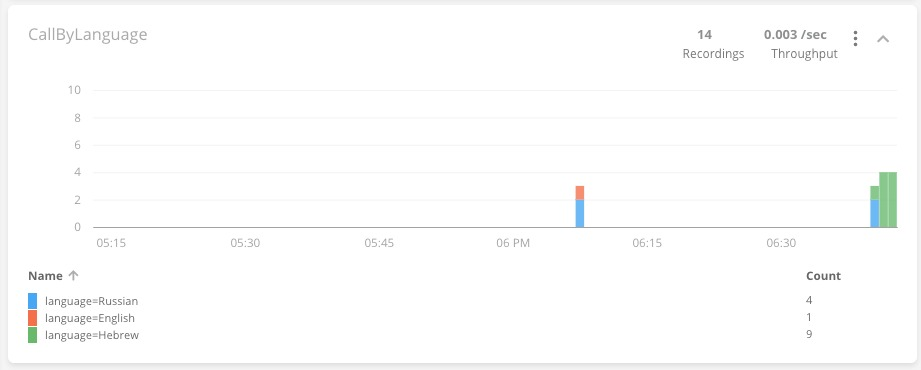
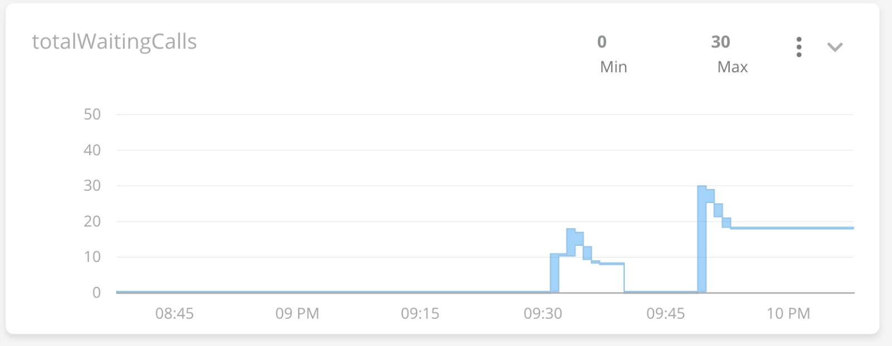
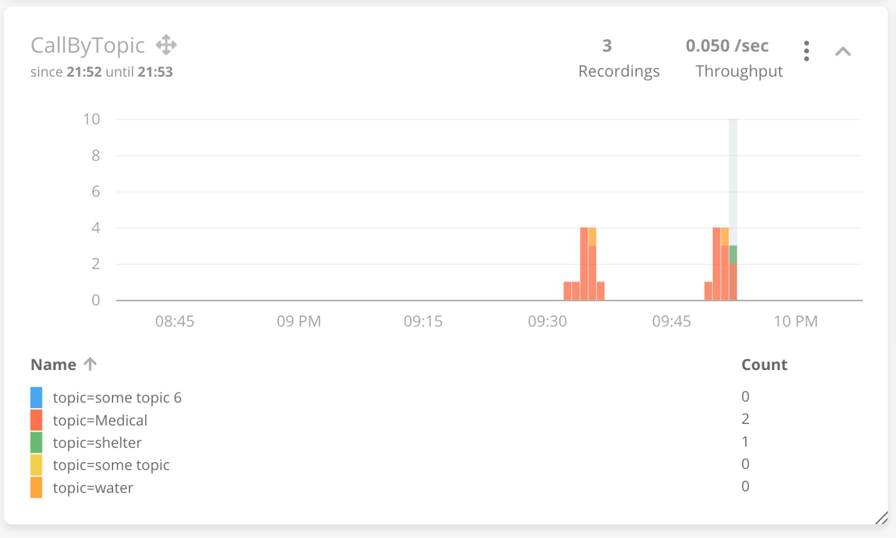
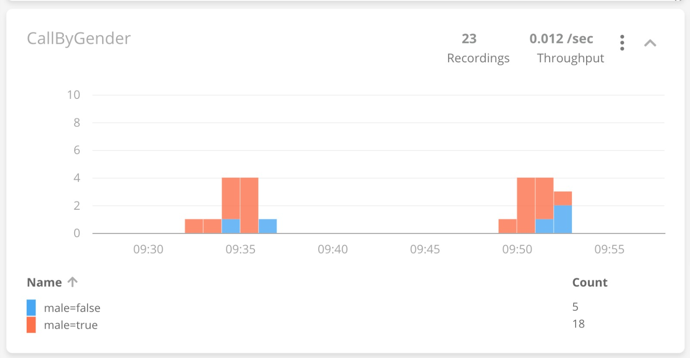
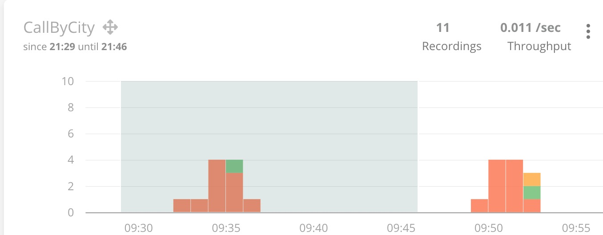
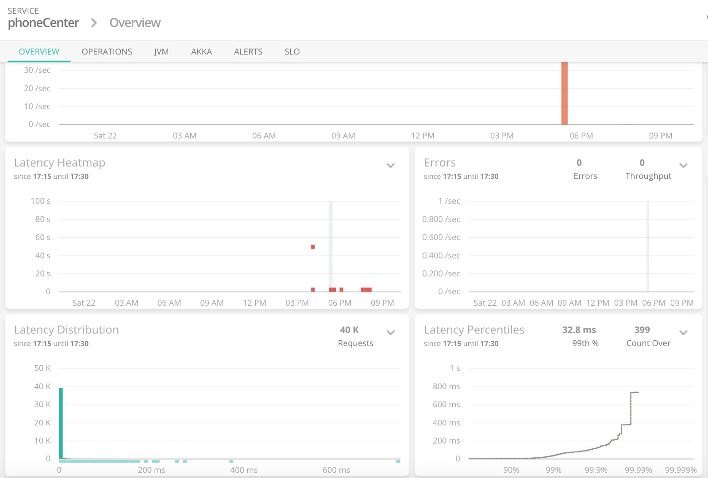

# PhoneCenter &nbsp;&nbsp; 
Phone Center Architecture using Play, Akka, Scala, Kafka, Kamon &amp; Datadog

Created during the third year at <strong><em>Ariel University</em></strong> in the 
Department of Computer Science, 2020   
<strong>Project site:</strong>&nbsp;<a href="https://github.com/ZviMints/PhoneCenter">https://github.com/ZviMints/PhoneCenter</a>  
<strong>Made by: </strong> <a href="https://github.com/ZviMints">Zvi Mints</a>, and <a href="https://github.com/eilon26">Eilon Tsadok</a>

# Run The Project:
1. Open the terminal in this path: `PhoneCenter/CallProducer/` and run `sbt clean runProd -Dhttp.port=8080`
2. Open the terminal in this path: `PhoneCenter/CallConsumer/` and run `sbt clean runProd`
3. Start the MongoDB server.
4. run the Kafka server by the following commends: 
&nbsp; `bin/zookeeper-server-start.sh config/zookeeper.properties`  
&nbsp; `bin/kafka-server-start.sh config/server.properties`
5. Start Redis with Kitematic on `localhost:6379`
6. Open https://apm.kamon.io/demo/demo/dashboards/ to get analytics.
7. **Open the browser and go to the url https://localhost:8080/ and start to answer calls.**
 
<h1>About The Project:</h1>
We have developed an <strong>asynchronous system</strong> that aims to simulate the architecture of a phone call center: 
<strong>Flow: (CallProducer Service)</strong> 
1. The user enters a call by clicking the `סיום` button. 
2. The call is sent to route named `/send` which aims to enter the call with the `Ready` status into the database. 
3. There is Akka's Actor who from time to time gets all the calls with the Ready status and locks them (in order to avoid Race Conditions). 
4. The Actor sends the message to Kafka on topic `callsTopic` which is env variable. 
5. When user press `set` button with new number of waiting calls, a new message send to Kafka with that number on topic `monitorTopic` which is env variable. 
 
<strong>Flow: (CallConsumer Service)</strong>

1. As soon as the app goes up there is an Actor who wakes up and listens to Kafka. 
2. Once there is a new message, the call is being saved into the cache (when the cache is implemented by Redis) for 12 hours. 
3. There is an update of new metrics by Kamon. 
4. There is a send from Kamon to APM Kamon Dashboard which graphically displays the information. 

 

<strong>Below are pictures of the Dashboard: (You can select `start time` and `end time` for each metric)</strong>

 

 

 

 

 

 

 

